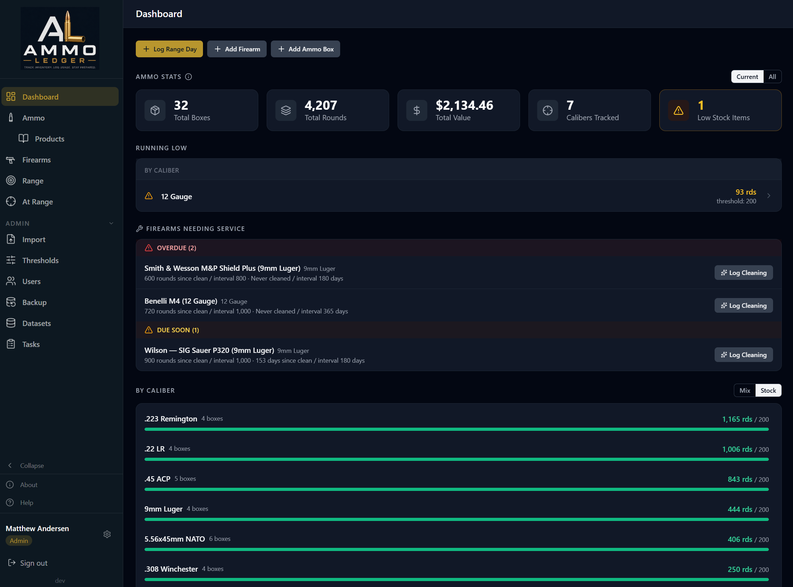
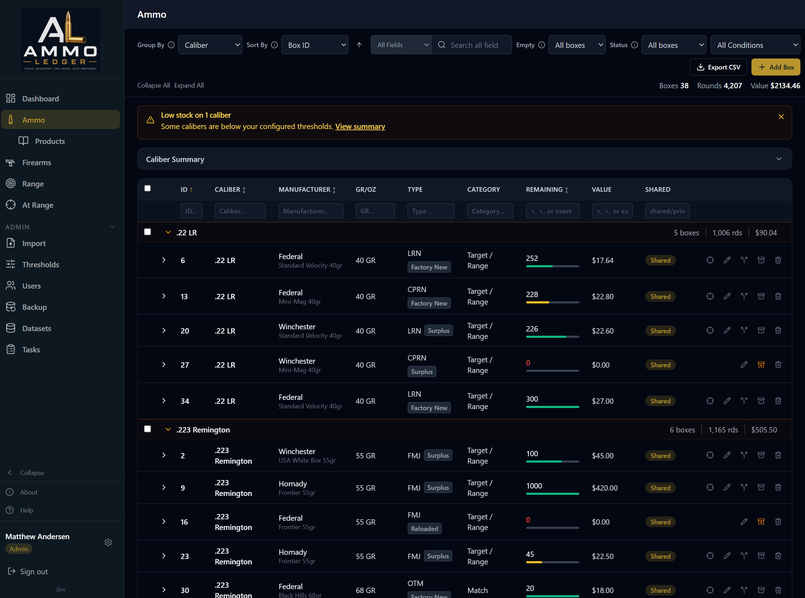
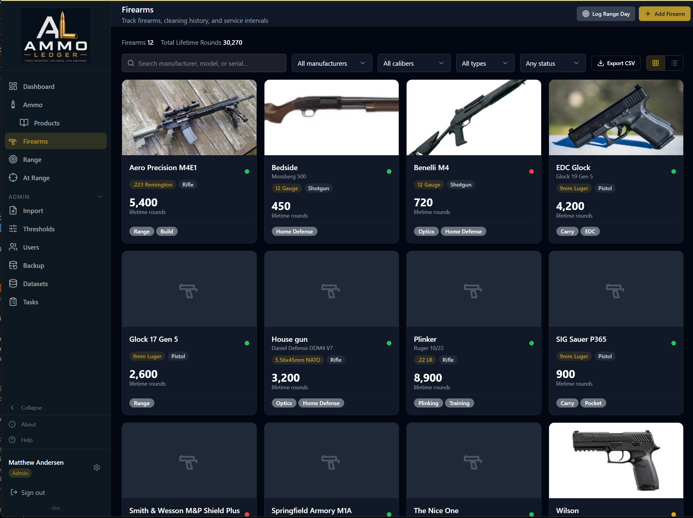
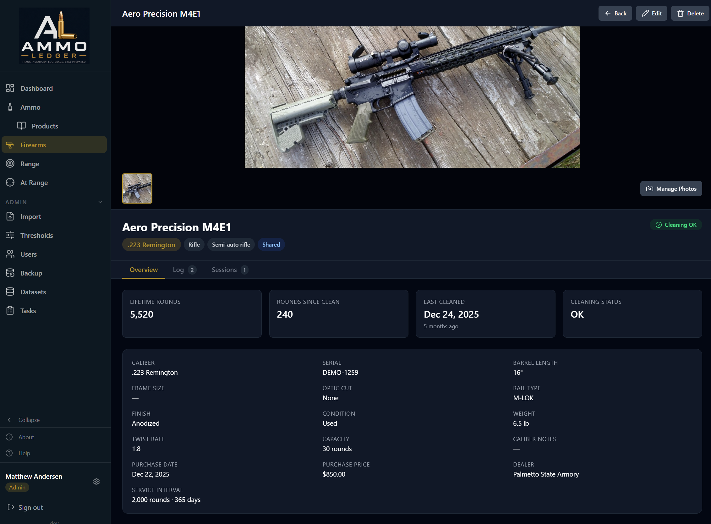
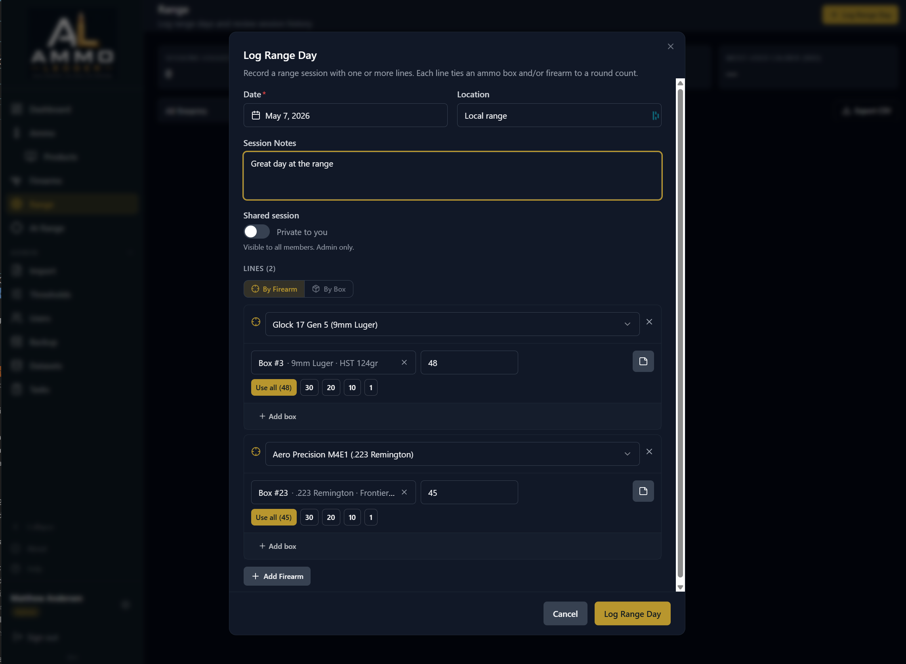
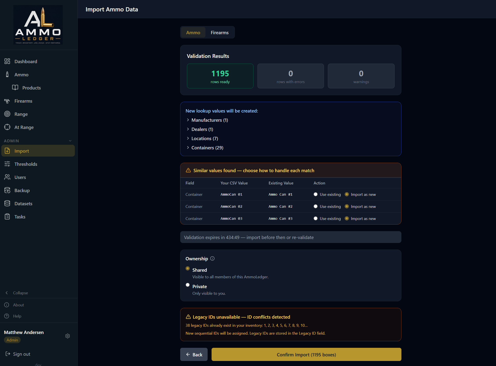

<div align="center">
  
</div>

<div align="center">


</div>

# AmmoLedger

AmmoLedger is a self-hosted web app for tracking your ammunition inventory, firearms, and range sessions. Run it on your own hardware with Docker — your data never leaves your machine. Keep accurate round counts on and off the range.

> **Latest release:** see the [Changelog](./CHANGELOG.md) for what's new in the current and past releases.

## Screenshots

<table>
  <tr>
    <td width="50%"></td>
    <td width="50%"></td>
  </tr>
  <tr>
    <td width="50%"></td>
    <td width="50%"></td>
  </tr>
  <tr>
    <td width="50%"></td>
    <td width="50%"></td>
  </tr>
</table>

## Key Features

### Ammo Tracking

Track every box and lot of ammo you own.

- Add, edit, archive, and delete boxes — including bulk edits across multiple rows
- Quick-expend (crosshair) inline round logging with smart presets; "At Range" mobile mode
- Product catalog with images and auto-fill; auto-generate products from existing inventory
- Organize your inventory your way — group by caliber, location, manufacturer and more; sort and search by any field; filter by range (for example, "boxes with fewer than 50 rounds left")
- Three-tier low-stock thresholds (global / per-caliber / per-location)
- Dashboard caliber mix and stock-vs-threshold views; Current vs All scope toggle

### Firearm Tracking

Registry of every firearm with specs and provenance.

- Register manufacturer, model, caliber, serial, barrel, finish, capacity, purchase details, and dealer
- Multi-select compliance tags (CA / NY / MA / NJ / NFA) and per-user colored personal tags
- Up to 5 photos per firearm with drag-to-reorder and a lightbox viewer
- Card-grid or list view filtered by manufacturer, caliber, type, or cleaning status
- Built-in catalog of popular manufacturers and models speeds entry

### Range Tracking

Log range days that keep ammo and firearm counters honest.

- Multi-line range sessions; each line ties an optional firearm to an optional ammo box
- Rounds fired deduct from the box and bump the firearm's counters in one transaction
- Editing or deleting a session reverses every side effect cleanly
- Per-firearm range history tab with rounds totals
- Recent range sessions widget on the dashboard

### Cleaning & Round Utilization by Firearm

The maintenance story that ties rounds fired to upkeep.

- Per-firearm Cleaning / Service / Note log with backdated entries
- Round-based and time-based service intervals
- Green / amber / red cleaning-status indicator on every firearm card and on the dashboard
- "Firearms Needing Service" dashboard widget with inline Log Cleaning
- Lifetime and since-clean round counters maintained automatically

### Also included

user roles (Admin / Member / Read-Only) with invitations, CSV import/export for ammo and firearms, backup & restore (safe SQLite snapshots + JSON export), a first-run setup wizard, a searchable Help/FAQ page, an About page with version check, an Admin Tasks page for scheduled jobs, and a Datasets page for community-maintained lookups.

## Community Data

AmmoLedger ships with community-maintained lookup data — dealers, manufacturers, calibers, ammo types, and firearm taxonomies (action types, models, frame sizes, optic cuts, rail types, finishes, compliance tags). These sync automatically from this repository on startup, and admins can review and import new entries from the Datasets page.

**Want to contribute a dealer, caliber, or firearm model?** Read [community/README.md](community/README.md) for the full list of YAML files and [CONTRIBUTING.md](CONTRIBUTING.md) for how to submit changes.

## Documentation

- [Product Requirements Document](docs/PRD.md) — full feature specs, data model, architecture decisions, and roadmap
- [Installation Guide](docs/INSTALL.md) — detailed setup, environment variables, NAS / PUID-PGID, reverse-proxy topology, upgrades, and DB maintenance

**Project history:** see [docs/HISTORY.md](./docs/HISTORY.md) for structural events and [docs/CHANGELOG-0.1.x.md](./docs/CHANGELOG-0.1.x.md) for the 0.1.x changelog archive.

## Quick Start

> Requires Docker with Docker Compose. Works on Linux, macOS, Windows (Docker Desktop), and NAS / home servers (Synology, Unraid, TrueNAS).

**1. Download the compose file:**

```bash
curl -O https://raw.githubusercontent.com/crzykidd/AmmoLedger/main/docker-compose.yml
```

**2. Start it:**

```bash
docker compose up -d
```

**3. Open <http://localhost:5173>** and create your admin account.

That's it. Docker pulls the images from GHCR automatically. For external access, optional settings, NAS file ownership (PUID/PGID), and reverse-proxy setup, see the [Installation Guide](docs/INSTALL.md).

### Without Docker Compose

If you'd rather not use Compose, you can start the two containers by hand.
AmmoLedger has two parts — a **backend** (the engine) and a **frontend** (the
web page) — and the frontend needs to find the backend by name on a shared
network. These commands set that up:

```bash
# 1. Create a private network so the two containers can find each other
docker network create ammoledger

# 2. Start the backend — it MUST be named "backend" (the frontend looks for it
#    by that name)
docker run -d \
  --name backend \
  --network ammoledger \
  -v ammoledger_data:/data \
  ghcr.io/crzykidd/ammoledger-backend:latest

# 3. Start the frontend and open it on http://localhost:5173
docker run -d \
  --name frontend \
  --network ammoledger \
  -p 5173:5173 \
  -e AL_BACKEND_URL=http://backend:8000 \
  ghcr.io/crzykidd/ammoledger-frontend:latest
```

Then open <http://localhost:5173>. Docker Compose does all of this in one
command, which is why it's the recommended path — but the result is the same.

> **Windows note:** the `\` at the end of each line is for Linux/Mac shells. In
> PowerShell, put each `docker run` on one line, or use a backtick `` ` `` at
> the end of each line instead of `\`.

### Pulling a specific version

```bash
# Latest stable release
docker pull ghcr.io/crzykidd/ammoledger-backend:latest
docker pull ghcr.io/crzykidd/ammoledger-frontend:latest

# Specific version
docker pull ghcr.io/crzykidd/ammoledger-backend:0.3.6
docker pull ghcr.io/crzykidd/ammoledger-frontend:0.3.6

# Latest development build (may be unstable)
docker pull ghcr.io/crzykidd/ammoledger-backend:dev
docker pull ghcr.io/crzykidd/ammoledger-frontend:dev
```

> For stable releases use the `:latest` tag — it advances on every merge to `main` and on every published release. `:dev` tracks the `dev` branch and may include work-in-progress changes.

### Database maintenance

Two optional scheduled SQLite maintenance tasks (Optimize, Vacuum) are available on the Tasks page — see the [Installation Guide](docs/INSTALL.md#database-maintenance) for details and the disk-space caveat before enabling Vacuum.

## Roadmap

Planned features and enhancements are tracked as [GitHub issues](https://github.com/crzykidd/AmmoLedger/issues). Open one with what you'd like to see.

---

## For Developers (Building from Source)

### Developer Requirements

- Docker with Docker Compose
- Git
- Node.js 20+
- Python 3.12+

### Tech Stack

| Layer | Technology |
| ----- | ---------- |
| Backend | Python + FastAPI (`python:3.12.9-slim-bookworm`) |
| Frontend | React + Tailwind CSS (`node:20.19.1-slim` dev / `nginx:1.27-alpine` production) |
| Database | SQLite + SQLModel + Alembic migrations |
| Container | Docker + Docker Compose |

### Development Quick Start

**1. Clone the repo:**

```bash
git clone https://github.com/crzykidd/AmmoLedger.git
cd AmmoLedger
```

**2. Start the development environment:**

```bash
docker compose -f docker-compose.dev.yml up --build
```

**3. Open in your browser:**

- App: <http://localhost:5173>
- API docs: <http://localhost:8000/docs>

**4. VS Code users:**

Install the Dev Containers extension. When prompted, click **Reopen in Container** for a fully configured development environment.

### Development workflow

```bash
# Start in background
docker compose -f docker-compose.dev.yml up -d

# View logs
docker compose -f docker-compose.dev.yml logs -f

# Stop
docker compose -f docker-compose.dev.yml down

# Rebuild after dependency changes
docker compose -f docker-compose.dev.yml up --build

# Run database migrations manually
docker compose -f docker-compose.dev.yml exec backend alembic upgrade head

# Check migration status
docker compose -f docker-compose.dev.yml exec backend alembic current
```

> **Note:** The dev compose builds from source and mounts local directories for live reload. The production `docker-compose.yml` pulls pre-built images from GHCR.

### Contributing

- Read `CLAUDE.md` for project conventions and build status
- Read `docs/PRD.md` for full feature specifications
- Add entries to `CHANGELOG.md` `[Unreleased]` with your changes
- Every PR that changes the data model must include an Alembic migration file

---

## Data Directory

All runtime data lives in the `ammoledger_data` Docker volume, mounted at `/data` inside the container and created automatically on first startup. Inside that volume:

```
/data
├── ammoledger.db        # SQLite database
├── config.yaml          # App settings and secrets (auto-created)
├── defaults.yaml        # Editable seed data
├── backups/             # Backup files (auto-created)
└── uploads/             # Product and firearm images (auto-created)
```

Because this is a Docker named volume, there is no `data/` folder sitting next
to your compose file by default — the files live inside the volume Docker
manages. The easiest way to get a copy of your data is the built-in backup on
the Backup page, which writes a downloadable archive. See the
[Installation Guide](docs/INSTALL.md) for the full backup and restore workflow,
and for how to bind-mount a host folder instead if you'd rather have the files
directly on disk.

## Project Structure

```
AmmoLedger/
├── backend/
│   ├── main.py              # FastAPI app, startup sequence
│   ├── models.py            # SQLModel database models
│   ├── database.py          # Engine and Alembic runner
│   ├── version.py           # Version string and build info
│   ├── defaults.yaml        # Bundled seed data (shipped in container image)
│   ├── routers/             # API route handlers
│   ├── utils/
│   │   ├── config.py        # load_config(), ensure_data_dirs()
│   │   ├── rbac.py          # require_auth(), require_role() dependencies
│   │   ├── security.py      # hash_password(), verify_password()
│   │   ├── seeds.py         # sync_yaml_seeds()
│   │   └── version_check.py # GitHub version comparison logic
│   ├── migrations/          # Alembic migration files
│   └── requirements.txt
├── frontend/
│   ├── src/
│   │   ├── App.tsx
│   │   └── main.tsx
│   ├── package.json
│   └── vite.config.ts
├── community/               # Community-maintained lookup YAML
├── data/                    # Runtime data volume (mostly git-ignored)
├── docs/
│   ├── PRD.md
│   ├── INSTALL.md
│   ├── HISTORY.md
│   └── img/                 # README screenshots
├── docker-compose.yml
├── docker-compose.dev.yml
├── Dockerfile.backend
├── Dockerfile.frontend
└── .gitignore
```

## License

MIT
